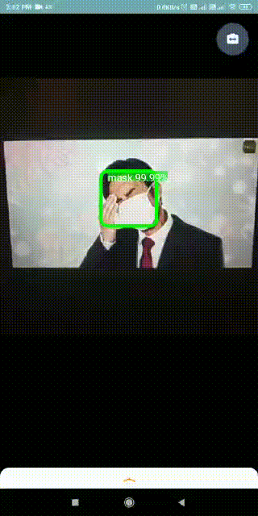
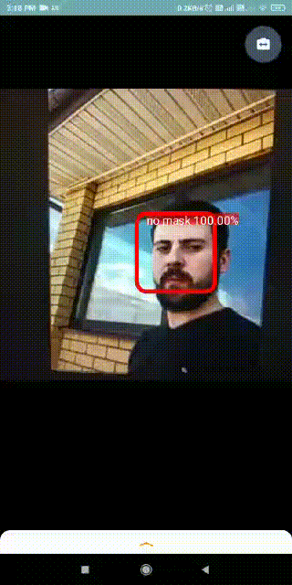

# Real time face mask detection in Android 

  

### Overview
The recent coronavirus pandemic has pushed people around the world to new challenges. In this context of uncertainty, we can all play our role by contributing to the fight against this disease. This is an excellent opportunity to put technology at the service of humanity. From my place I could try to contribute with the tools that I can work on. So here I've developed an application to detect face masks in the smartphone. This application works in real time.

## A good face mask detector for mobile
The great Adrian Rosebrock, has recently published  [a great article](https://www.pyimagesearch.com/2020/05/04/covid-19-face-mask-detector-with-opencv-keras-tensorflow-and-deep-learning/) about how to train a deep learning model to achieve this task. In his post he used [this](https://github.com/prajnasb/observations) dataset provided by [Prajna Bhandary](https://www.linkedin.com/feed/update/urn:li:activity:6655711815361761280/), which was very cleverly generated (by artificially drawing face masks over the positions of detected face landmarks).
The approach proposed by Adrian is to utilize a two-stages detector, first a face detector is applied, to retrieve the faces positions. Then each face is cropped and prepossessed to be feed into the second model which does a binary classification detecting between **"mask"** or **"no-mask"**.

The model was converted from Keras to TensorFlow Lite using the **TocoConverter** python class to migrate from the Keras '*.h5'* format to the TensorFlow Lite *'.tflite'* format.

## Based on TensorFlow Lite Object Recognition Example
This code modified from the TensorFlow's object detection canonical example, to be used with the face mask model described above. In that repository we can find the source code for Android, iOS and Raspberry Pi.
This model is built using TocoConverter python class to migrate from the Keras ‘.h5’ format to the TensorFlow Lite ‘.tflite’ format. The model was created by using transfer learning over the MobileNetV2 architecture, producing a ‘.h5’ file of about 11.5 MB. After TensorFlow Lite conversion, the resulting file is very light-weight only 9.5 MB, really good for a mobile application.